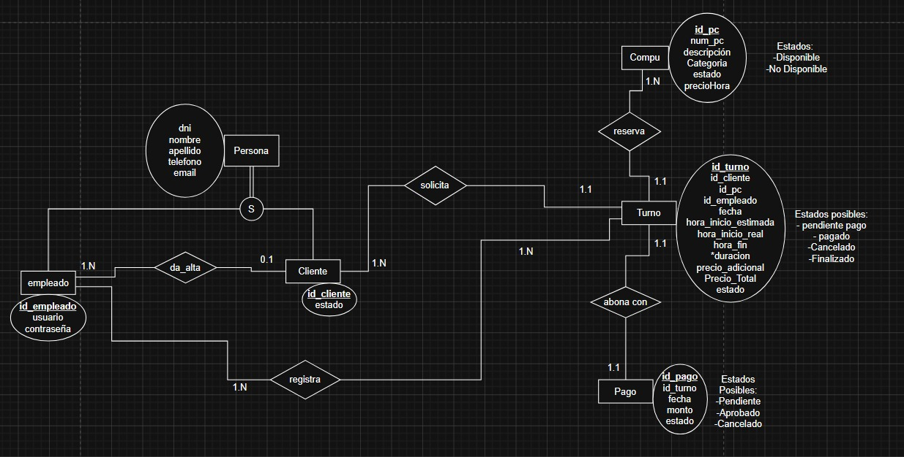

# Propuesta TP DSW

## Grupo
### Integrantes
* 53660 - Figoni, Matias
* 55276 - Díaz, Marcio
* 54685 - Mascheroni, Lucas

### Repositorios
* [frontend app](http://hyperlinkToGihubOrGitlab)
* [backend app](http://hyperlinkToGihubOrGitlab)
*Nota*: si utiliza un monorepo indicar un solo link con fullstack app.

## Tema
### Descripción
*Sistema de gestión para un ciber centrado en la asignación de turnos para el uso de computadoras, donde un usuario se registra en la app web para solicitarlo o el empleado lo registra en la misma app web y lo solicita por el en el momento.*

### Modelo

## Alcance Funcional 

### Alcance Mínimo

Regularidad:
|Req|Detalle|
|:-|:-|
|CRUD simple|1. CRUD Computadora 2. CRUD Cliente 3. CRUD Empleado|
|CRUD dependiente|1.CRUD Computadora {depende de} CRUD Tipo 2.CRUD Computadora {depende de} CRUD Mantenimiento|
|Listado + detalle|1. Listado de computadora filtrado por tipo, muestra tipo de computadora y disponibilidad => detalle CRUD Computadora, CRUD Mantenimiento, CRUD Tipo 2. Listado de reservas filtrado por rango de fecha y tipo computadora, muestra nro de computadora, fecha y hora de inicio y fin, estado, nombre cliente => detalle muestra datos completos del cliente y el precio total del turno|
|CUU/Epic|1.Reservar turno para computadora 2.Realizar el check-in de un turno|

Adicionales para Aprobación
|Req|Detalle|
|:-|:-|
|CRUD |1.CRUD Computadora 2.CRUD Cliente 3.CRUD Empleado 4.CRUD Tipo 5.CRUD Tarifa 6.CRUD Pago 7.CRUD Mantenimiento|
|CUU/Epic|1.Reservar turno para computadora 2.Realizar el check-in de un turno 3.Realizar pago via Mercado Pago|

### Alcance Adicional Voluntario

|Req|Detalle|
|:-|:-|
|Listados ||
|CUU/Epic||
|Otros|1. Envío de recordatorio de reserva por email|

